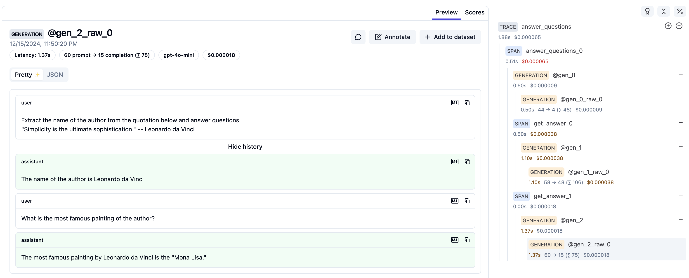

# Setup Guide
You need to set up API keys or your own LLM backends to interact with LLMs.
Besides, APPL has many configurations that you can customize to fit your needs.

## Setup Environment Variables

### Using Dotenv (Recommended)
We recommended you to store all your environment variables, including API keys, in a `.env` file in the root directory of your project (or other directories, see [Priority of Configurations](#priority-of-configurations) for more details). Based on the [`python-dotenv`](https://github.com/theskumar/python-dotenv) package, APPL will automatically load the environment variables into the current environment.

!!! warning "Remember to setup your .gitignore file"
    Make sure to add `.env` to your `.gitignore` file to prevent it from being committed to your repository.

For example, you can create a `.env` file with the following content to specify your OpenAI API key:

```bash title=".env"
OPENAI_API_KEY=<your openai api key>
```

We provide an example of `.env.example` file in the root directory, you can copy it to your project directory and modify it.
```bash title=".env.example"
--8<-- ".env.example"
```

### Export or Shell Configuration
Alterantively, you can export the environment variables directly in your terminal, or add them to your shell configuration file (e.g., `.bashrc`, `.zshrc`). For example:
```bash
export OPENAI_API_KEY=<your openai api key>
```

## Setup APPL Configuration

### Default Configs
[`default_configs.yaml`](https://github.com/appl-team/appl/blob/main/src/appl/default_configs.yaml) contains the default configurations for APPL. 
```yaml title="default_configs.yaml" linenums="1"
--8<-- "src/appl/default_configs.yaml"
```

??? note "Setup your default models"
    You should specify your own default model in the `appl.yaml` file. You may also specify the default "small" and "large" models, which will fallback to the default model if not specified.
    The name can be a server name in your configuration (`servers` section), or a model name that is supported by litellm.
    ```yaml title="appl.yaml (example)"
    settings:
      model:
        default: gpt-4o-mini # small model fallback to this
        large: gpt-4o
    ```

### Override Configs
You can override these configurations by creating a `appl.yaml` file in the root directory of your project (or other directories, see [Priority of Configurations](#priority-of-configurations) for more details). A typical usage is to override the `servers` configuration to specify the LLM servers you want to use, as shown in the following example `appl.yaml` file.

```yaml linenums="1" title="appl.yaml (example)"
--8<-- "examples/appl.yaml"
```

??? question "How configurations are updated?"
    The configurations are implemented as a nested dictionary in Python using [`addict.Dict`](https://github.com/mewwts/addict). The update is recursively applied according to [this link](https://github.com/mewwts/addict?tab=readme-ov-file#update).

??? info "Other file formats like JSON or TOML are also supported."
    You can also use other file formats, such as JSON (`appl.json`) or TOML (`appl.toml`), to specify the configurations. We recommend using YAML for better readability.

## Setup LLMs

You can configure the LLM servers in the `appl.yaml` file by overriding the `servers` configuration as shown in the example above.

### LLM APIs
APPL uses [litellm](https://docs.litellm.ai/) to support various LLM APIs using the OpenAI format. Please refer to the [list of supported providers](https://docs.litellm.ai/docs/providers).

You need to setup the corresponding API keys for the LLM backend you want to use in [environment variables](#setup-environment-variables) and specify [corresponding configurations in `appl.yaml`](#setup-appl-configuration).

An example of `.env` file that matches the [`appl.yaml` example above](#override-configs) to support using APIs from OpenAI, Anthropic, Azure, Moonshot, and DeepSeek is as follows:

```bash title=".env"
OPENAI_API_KEY=<your openai api key>
# Anthropic environment variables
ANTHROPIC_API_KEY=<your anthropic api key>
# Azure environment variables
AZURE_API_KEY=<your azure api key>
AZURE_API_BASE=<the base url of the API>
AZURE_API_VERSION=<the version of the API>
# Moonshot environment variables
MOONSHOT_API_KEY=<your moonshot api key>
# DeepSeek environment variables
DEEPSEEK_API_KEY=<your deepseek api key>
```

### Local LLMs
We recommend using [SGlang Runtime (SRT)](https://github.com/sgl-project/sglang?tab=readme-ov-file#backend-sglang-runtime-srt) to serve the local LLMs, which is fast and supports the regex constraints. You can install it following [the official guide](https://github.com/sgl-project/sglang?tab=readme-ov-file#install).
<!-- automatic KV cache reuse with RadixAttention -->

To serve local LLMs, please following [SGLang's official guide](https://github.com/sgl-project/sglang?tab=readme-ov-file#backend-sglang-runtime-srt).

Using Llama-2-7b-chat-hf as an example:
```bash
python -m sglang.launch_server --model-path meta-llama/Llama-2-7b-chat-hf --port 30000
```

You may also use [vLLM](https://github.com/vllm-project/vllm) to host a local server, and the usage in APPL is similar to SRT.

## Setup Tracing

### APPL Tracing
You can enable APPL tracing by overriding the `tracing` configuration to `true` in `appl.yaml`.
```yaml title="appl.yaml"
settings:
  tracing:
    enabled: true
```

To resume from a previous trace, you can specify the `APPL_RESUME_TRACE` environment variable with the path to the trace file. See more details in the [tutorial](./tutorials/7_tracing.md).

## Visualize Traces

### Langfuse (Recommended)

Langfuse is an open-source web-based tool for visualizing traces and LLM calls.

You can host Langfuse [locally](https://langfuse.com/self-hosting) or use [public version](https://langfuse.com/).

```bash
git clone https://github.com/langfuse/langfuse.git
cd langfuse
docker compose up
```

Then you can set the environment variables for the Langfuse server by:

```bash title=".env"
LANGFUSE_PUBLIC_KEY=<your-langfuse-public-key>
LANGFUSE_SECRET_KEY=<your-langfuse-secret-key>
LANGFUSE_HOST=<your-langfuse-host>
# Set to http://localhost:3000 if you are hosting Langfuse locally
```
You can find your Langfuse public and private API keys in the project settings page (Project Dashboard -> Configure Tracing).

Please see [the tutorial](./tutorials/7_tracing.md#langfuse-recommended) for more details.

You can see conversation like:



and the timeline like:


### Lunary
Please see [the tutorial](./tutorials/7_tracing.md#lunary) for more details.

### LangSmith
To enable [LangSmith](https://docs.smith.langchain.com/) tracing, you need to to [obtain your API key](https://smith.langchain.com/settings) from LangSmith and add the following environment variables to your `.env` file:

```bash title=".env"
LANGCHAIN_TRACING_V2=true
LANGCHAIN_API_KEY=<your api key>
# [Optional] specify the project name
# LANGCHAIN_PROJECT=<your project name>
```

## Priority of Configurations
Let's say you are running a script (`python main.py`) in the `project` directory, and you have the following directory structure:

```plaintext
.env
appl.yaml
project/
├── .env
├── appl.yaml
└── main.py
```

Starting from the directory containing the file to be executed (in this case, `main.py`), APPL will walk up the directory tree to find custom configurations. The configurations in the files closer to the file will have higher priority. For the `.env` file, the search starts from the current working directory (`project` directory in this case).

In this case, the configurations in `appl.yaml` will be loaded first, followed by the ones in `project/appl.yaml` with overriding the previous ones. The environment variables in `.env` will be loaded first, followed by the ones in `project/.env` with overriding the previous ones.

!!! warning "Difference between `.env` and `appl.yaml`"
    - `.env` is used to store environment variables, including API keys. The contents should not be committed to the repository as they may contain sensitive information.
    - `appl.yaml` is used to store APPL configurations, such as LLM servers and tracing settings. When used in a project, it should not contain sensitive information. The settings in general should be committed to the repository so that others can reproduce the results.
