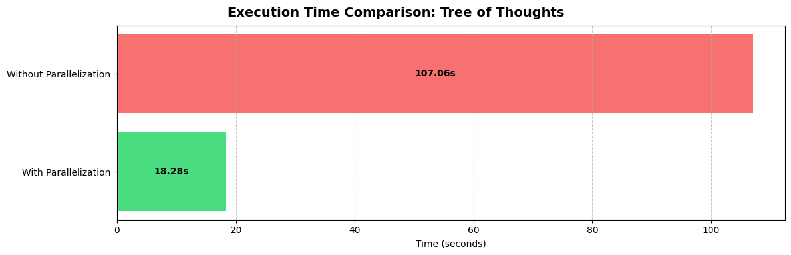

# Reimplementing Tree of Thoughts

Re-implementing the Tree of Thoughts (ToT) [[original repo](https://github.com/princeton-nlp/tree-of-thought-llm)] with APPL.
Implemented for the Game of 24 problem within a single file.

## Usage
```bash
python tot.py --task-start-index 900 --task-end-index 901
```

In the end, you will see output like: `Proposed solution (10 - 4) * 5 - 6 for 4 5 6 10 is correct`

## Time Comparison



Parallelization gives 6x speed up when using `GPT-4o-mini`.
